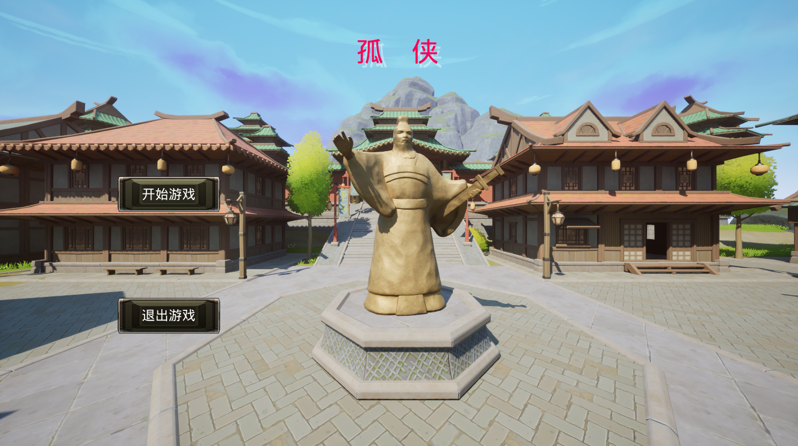
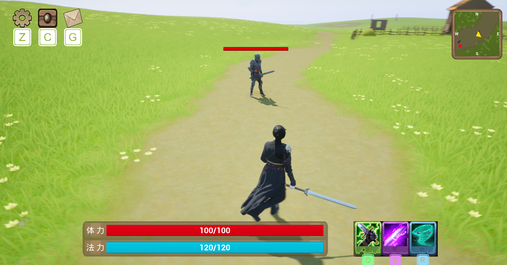
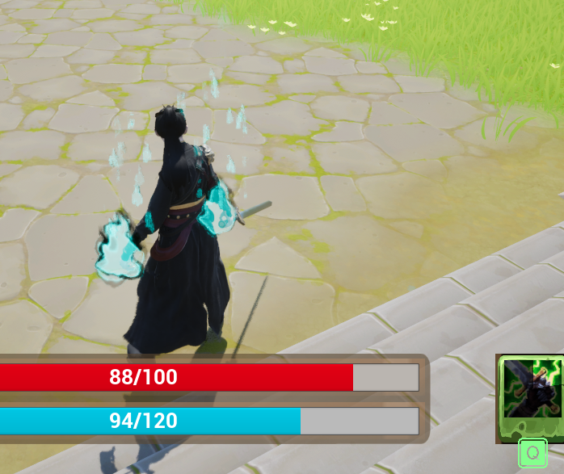
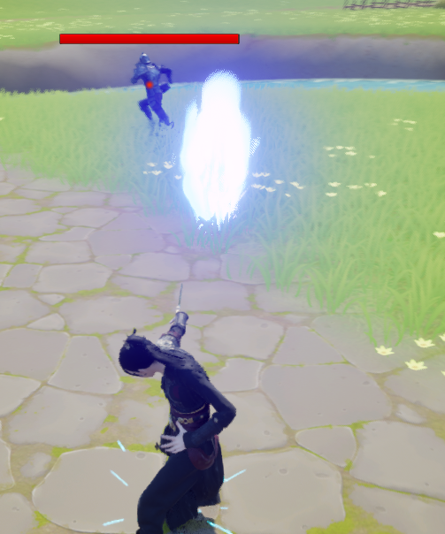
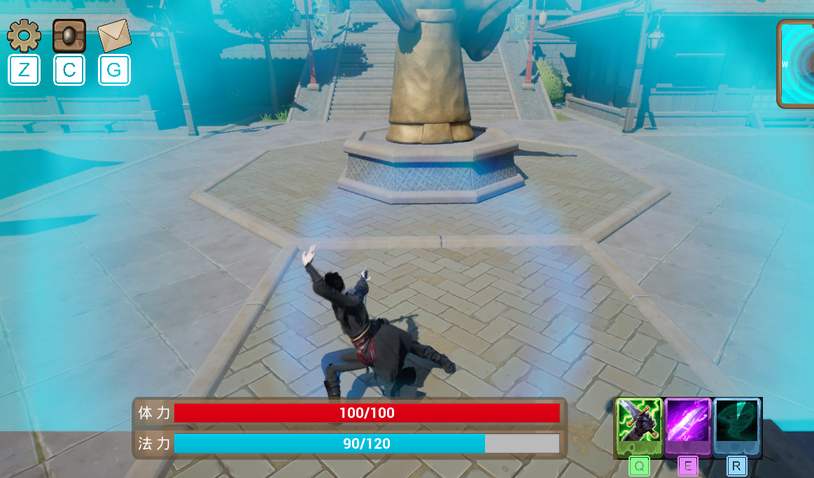
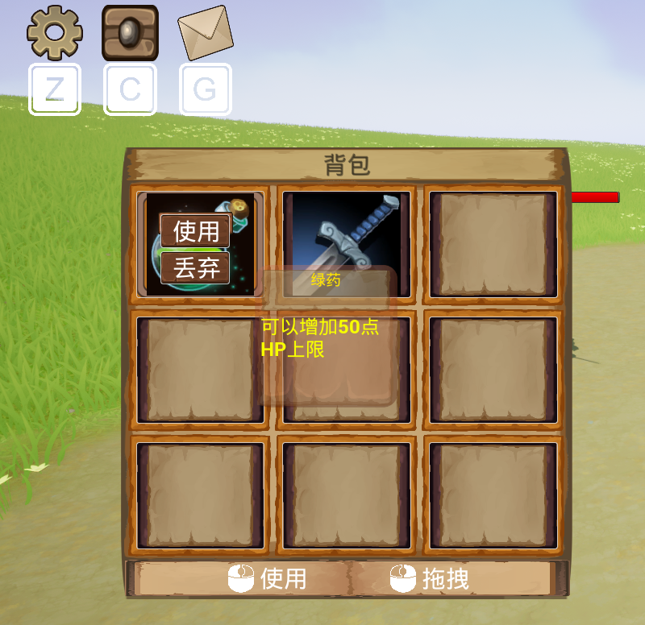
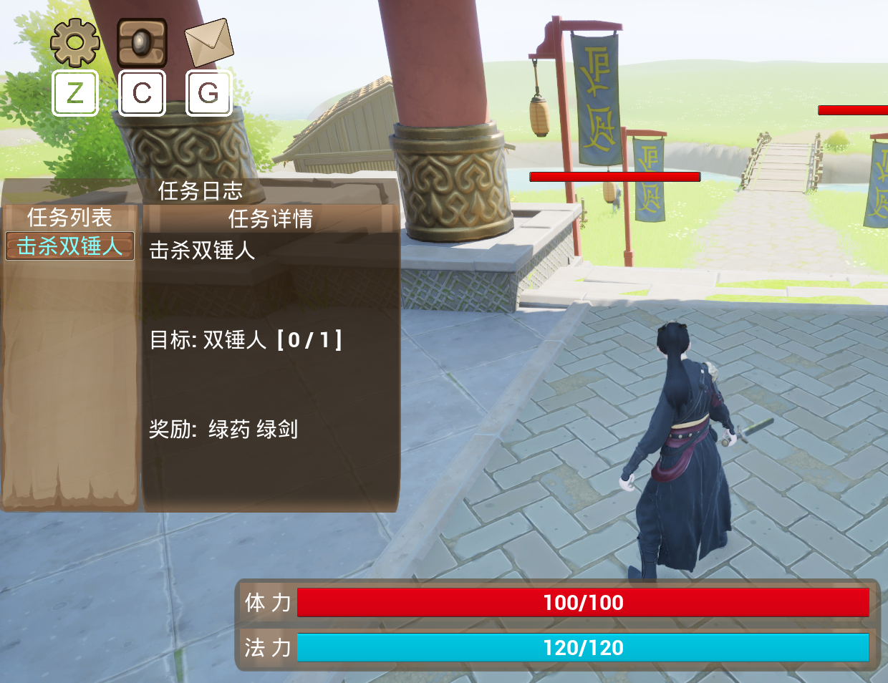
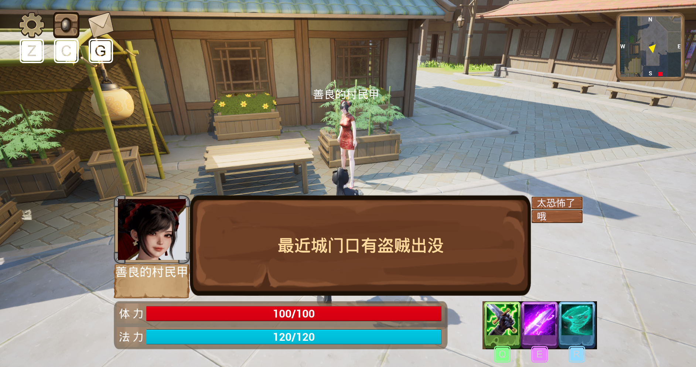
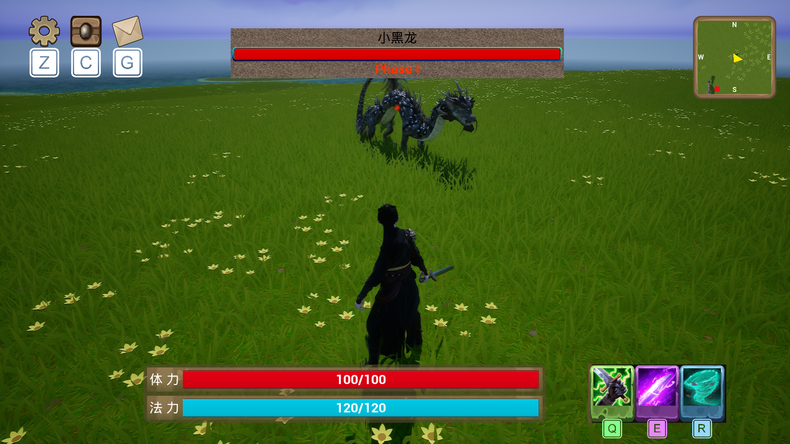

# DawnlightRealm (孤侠)

This repository contains the code and Blueprint implementations for a 3D single-player RPG demo developed with Unreal Engine, along with a small number of example assets.

This project focuses on implementing core gameplay systems such as combat, enemy AI, inventory management, skill abilities, and quest mechanics using Blueprint and Unreal Engine gameplay frameworks.

这是一个使用虚幻引擎开发的 3D 单人 RPG 游戏 Demo 项目，仓库中包含核心玩法系统的代码与蓝图实现，以及少量示例资源。
该项目主要实现了一系列核心玩法系统，包括战斗系统、技能系统、敌人 AI、背包系统、任务系统以及 NPC 交互系统。项目重点在于 **Gameplay 系统架构与 Blueprint 逻辑实现**。

## Features / 项目功能

### Combat System / 战斗系统

- Light attack and heavy attack system
- Lock-on targeting system

近战战斗系统，支持 **锁定目标 与 普通攻击和重击**。

### Skill System / 技能系统

- Q / E / R skill abilities
- Skill animation montage integration

实现了 **Q / E / R 技能系统**，并结合动画蒙太奇与技能效果。

### Enemy AI / 敌人 AI

- Behavior Tree AI system
- Patrol and combat behaviors

基于 **Behavior Tree 的敌人 AI 系统**，包含巡逻、攻击等行为逻辑。

### Inventory System / 背包系统

- Item pickup system
- Equipment and consumable items
- UI inventory interface

实现 **道具拾取、装备与消耗品管理，以及背包 UI 界面**。

### Quest System / 任务系统

- Quest accept and completion logic
- NPC interaction
- Quest UI display

实现 **任务接取、完成逻辑以及 NPC 对话系统**。

### UI System / UI界面

- Player HUD
- Inventory UI
- Quest UI
- Boss health bar
- Minimap system

包含 **玩家 HUD、背包 UI、任务 UI、Boss 血条与小地图系统**。

## Screenshots / 游戏截图

### Main UI

### Lock-On Combat

### Skill System

### Inventory System

### Quest System

### Dialogue System

### Boss Battle

## Notes / 说明

Some assets used in this project are from Fab and are **not included in this repository**.

本项目中使用的部分资源来自 Fab，**未包含在仓库中**。
